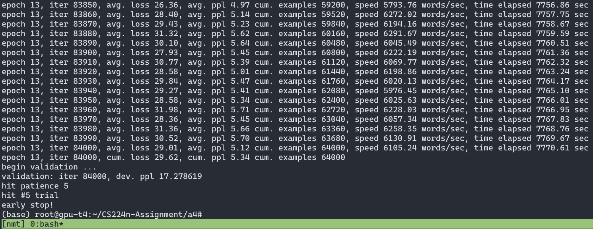
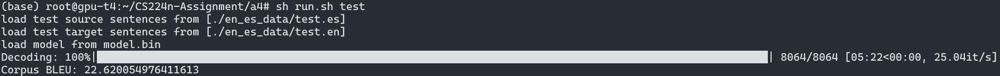

## 1. Neural Machine Translation with RNNs (45 points)
Bidirectional LSTM Encoder + Unidirectional LSTM Decoder
Spanish to English

### (g) enc_masks
enc_masks (b, src_len) 用于标记batch中每个句子中<pad>的位置为1

(1)作用：将注意力分数e_t中对应<pad>填充的部分设为$-\inf$，经过softmax后概率近乎为0

(2)为什么：可以屏蔽非句子本身的填充部分（填充是为了构造batch），将注意力集中到句子上

### (i) 测试结果
代码手刻了一个early stopping：跑完若干（默认2000）个batch后验证并保存当前性能最好的参数，发现性能下降时patience加1，patience达到限度（默认5）时衰减学习率，num_trail记录衰减次数，衰减一定次数后（默认5）停止训练。

大概训练13个epoch会停止：

测试结果BLEU Score达到 22.6：

Tensorboard（部分）：
- Average Loss（横轴为iter）:

- Average PPL（横轴为iter）

分析可知，图中台阶处是因为衰减学习率了。而每次陡降后有向上过拟合的趋势，可以考虑更快地衰减学习率。

因此我们将验证测试改为每1000个batch一次，即设置参数 `--valid-niter=1000` ，这样9个epoch即可拟合（减少了约1/3），并且获得了更好的BLEU分数，曲线也更加平滑：

### (j) 注意力机制对比：点积、乘法、加法
|            | 公式                                                                                                       | 优点                                 | 缺点               |     |
| ---------- | ---------------------------------------------------------------------------------------------------------- | ------------------------------------ | ------------------ | --- |
| 点积注意力 | $\mathbf{e}_{t, i}=\mathbf{s}_{t}^{T} \mathbf{h}_{i}$                                                      | 计算简单高效                         | 要求st和ti维度相同 |     |
| 乘法注意力 | $\mathbf{e}_{t, i}=\mathbf{s}_{t}^{T} \mathbf{W} \mathbf{h}_{i}$                                           | 高度优化的矩阵乘法，算法效率比加法高 | 训练参数增多       |     |
| 加法注意力 | $\mathbf{e}_{t, i}=\mathbf{v}^{T}\left(\mathbf{W}_{1} \mathbf{h}_{i}+\mathbf{W}_{2} \mathbf{s}_{t}\right)$ | 高维度且不缩放时表现更好             | 训练参数最多       |     |

## 2. Analyzing NMT Systems (30 points)
### (a) 翻译错误分析
#### i.
- Error:  **favorite** of my favorites
- Reason: 特定的语言构造，one of...
- Possible fix: 增加该结构训练语料

#### ii.
- Error: the author for children, **more** reading
- Reason: （maybe）长句中特定的语言构造，the most...
- Possible fix: 增大模型容量，如增加hidden layer大小

#### iii.
- Error: Richard **\<unk\>**
- Reason: 模型限制，命名实体问题。Bolingbroke 不在词表中。
- Possible fix: 处理此类命名实体，可以直接加入词表

#### iv.
- Error: go back to the **apple**
- Reason: 模型限制，多义词错误。manzana是西班牙语多义词，可以表示 apple 苹果和 block 街区等。模型没有根据语义选择合适的翻译。
- Possible fix: 训练集中添加 “manzana” 表示 “block” 的数据

#### v.
- Error: the **women’s room**.
- Reason: 模型限制，训练集的bias。训练集中女性比教师出现频率更高。
- Possible fix: 训练集增加 profesore 样本

#### vi.
- Error: **100,000 acres**
- Reason: 模型限制，（时间词/数量词的）进制转换的常识错误。模型未学习到该进制的转换方法。
- Possible fix: 训练集增加 hectáreas 样本

### (b) 翻译错误寻找与分析
#### i.
Test集第37句：
- Source Sentence: Mi corazn lata rpido, estaba mareada, tratando de entender lo que estaba delante de m.
- Reference Translation: My heart beat fast, my head was dizzy,  trying to comprehend what it was that stood in front of me.
- NMT Translation: My heart can quickly, was \<unk\> trying to understand what was in front of me.
- Error: My heart **can** quickly
- Reason: 特定的语言构造，实词翻译缺失/错误。西班牙语 `late` 就是 `beat`、`pulse`的意思，这里对应反应成了情态动词can。`late rápido`是常用搭配，训练语料较少。
- Possible fix: 增加 late 训练语料

#### ii.
Test集第68句：
- Source Sentence: Y, en el otro caso, el cromosoma X del esperma se une al cromosoma X del vulo.
- Reference Translation: And in the other case,  the sperm is carrying an X chromosome,  meeting the X chromosome of the egg.
- NMT Translation: And in the other case, the X X of the sperm joins the X chromosome into the \<unk\>
- Error: the **X X** of the sperm
- Reason: 模型限制，特殊字词重复翻译/翻译缺失。这里的X指X染色体，没有翻译cromosoma（chromosome），而是翻译了两次X，猜想是注意力机制、对齐方式的缺陷。
- Possible fix: 优化对齐方式，优化注意力机制

### (c) BLEU Score
#### i.
$BP(c_1) = 1, p_1(c_1)=0.6, p_2(c_1)=0.5$
$BLEU(c_1)=BP(c_1) \times \exp(0.5\times \log(p_1)+0.5\times \log(p_2))=0.5477$

$BP(c_2) = 1, p_1(c_2)=0.8, p_2(c_2)=0.75$
$BLEU(c_2)=BP(c_2) \times \exp(0.5\times \log(p_1)+0.5\times \log(p_2))=0.6324$

$c_2$ is better, agreed.

#### ii.
$BP(c_1) = \exp(-\frac{1}{5}), p_1(c_1)=0.6, p_2(c_1)=0.5$
$BLEU(c_1)=BP(c_1) \times \exp(0.5\times \log(p_1)+0.5\times \log(p_2))=0.4484$

$BP(c_2) = \exp(-\frac{1}{5}), p_1(c_2)=0.4, p_2(c_2)=0.25$
$BLEU(c_2)=BP(c_2) \times \exp(0.5\times \log(p_1)+0.5\times \log(p_2))=0.2589$

$c_1$ is better, not agreed.

#### iii.
i. ii. 说明了单一的参考翻译可能引起某些好翻译因为与参考翻译重合度不够得分较低。

#### iv.
pros：
- 节省人力
- 标准同一，方便对比模型

cons：
- 可能因为好翻译与参考翻译重合度（n-gram overlap）不高而给出较低得分，尤其是语料不丰富时
- 只考虑了无顺序的n-gram，没有考虑词法（如单复数、时态）、句法（如结构和搭配）、语义（如相似表达）等信息